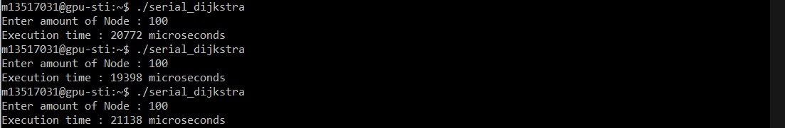
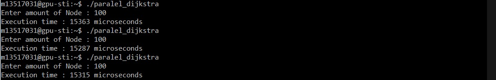
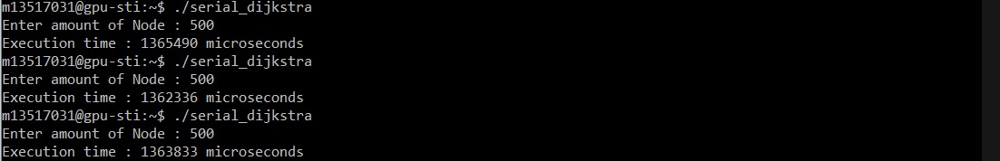
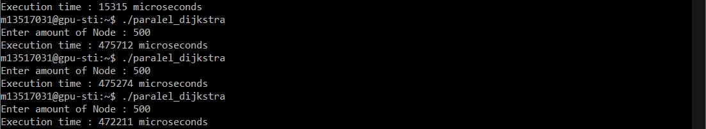
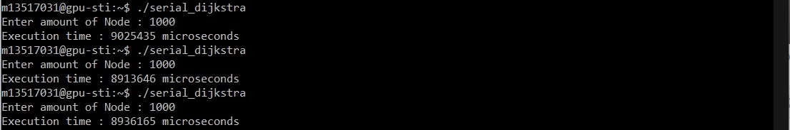
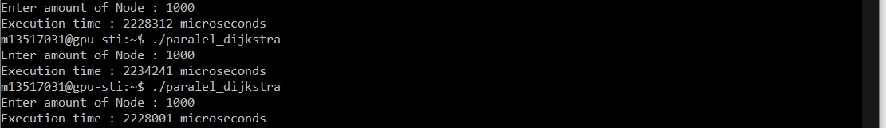
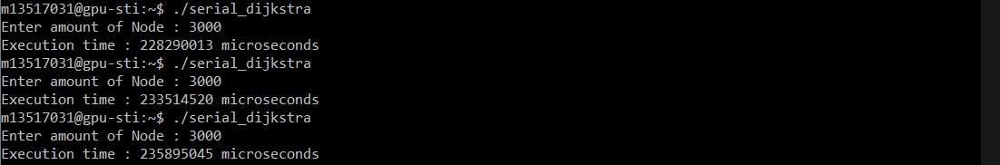
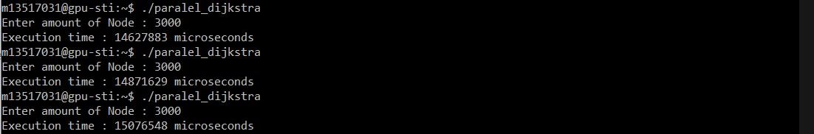

# Petunjuk Penggunaan Program
Untuk menjalankan program serial, gunakan perintah ‘make serial’.
Untuk menjalankan program paralel, gunakan perintah ‘make paralel’.
Setelah menjalankan perintah make, masukan jumlah node  yang diinginkan.
# Pembagian Tugas
| Nama | NIM | Pembagian Tugas |
| ------ | ------ | ------ | 
| Lydia Astrella Wiguna | 13517019 | Inisiasi, Implementasi program paralel berdasarkan program serial, Dokumen |
| Karina Iswara | 13517031 |  Inisiasi, Implementasi program paralel berdasarkan program serial, Dokumen |
# Deskripsi Solusi Paralel
Prosedur dijkstra yang mengkalkulasi jarak terdekat dari setiap node graf dibuat sebagai prosedur \__global__ yaitu prosedur yang dipanggil pada host namun dijalankan pada device. Fungsi yang dipanggil di dalam prosedur dijkstra dideklarasikan sebagai fungsi \__device__ yaitu fungsi yang dipanggil dan dieksekusi pada device (kernel). Selain kedua fungsi dan prosedur tersebut seluruh prosedur dan fungsi lain yaitu prosedur untuk menginisialisasi graf, print output ke file eksternal, dan main tidak dideklarasikan sebgai \__global__ maupun \__device__ sehingga secara default masuk ke dalam \__host__ yaitu prosedur yang dijalankan dan dipanggil pada host. Karena pengalokasian unified memory tidak bisa dalam bentuk array 2 dimensi, maka semua representasi matriks yang perlu dialokasi secara unified dijadikan bentuk array 1 dimensi (flatten).
Setelah pengguna menjalankan program paralel dan memasukkan jumlah Node yang diinginkan untuk dicari jarak terdekatnya, graf diinisialisasi. Lalu prosedur dijkstra dijalankan pada device. Pada prosedur dijkstra, setiap thread menjalankan program untuk mencari jarak terdekat dari satu sumber node ke seluruh node yang ada pada graf. Sehingga jumlah thread yang berjalan sebanyak jumlah node. Setelah prosedur dijkstra selesai, array (matriks yang di-flatten) yang menampung nilai jarak terdekat semua node ke seluruh node di-print ke file output.
## Analisis Solusi
Pada solusi paralel yang kami lakukan, waktu eksekusi yang dibutuhkan seharusnya menjadi lebih cepat jika dibandingkan dengan program serial karena pencarian jarak terdekat dari setiap sumber node pada solusi paralel dilakukan pada beberapa thread secara bersamaan sedangkan solusi serial mengeksekusi jarak terdekat dari semua sumber node dalam 1 proses (dalam solusi paralel beban kerja terbagi menjadi sejumlah thread).  Namun tentu saja dapat terjadi kasus dimana solusi paralel tidak lebih cepat dibandingkan solusi serial (bergantung pada jumlah thread dan node). Hal ini disebabkan oleh overhead pembuatan thread dan penghancuran thread.
Seharusnya terdapat kemungkinan masih ada solusi yang memberikan kinerja lebih baik. Sebagai contohnya membuat paralel pada pencarian jarak terdekat dari satu titik (node) ke titik lainnya. Yakni mengimplementasikan algoritma paralel langsung pada program yang mencari jarak terdekat dari 1 sumber node ke seluruh node yang ada.

# Jumlah Thread
Thread yang digunakan berjumlah 256 pada tiap block, dengan jumlah block bergantung pada N (jumlah Node) yakni dengan N/thread dengan pembulatan ke atas. Pemilihan jumlah thread secara demikian dikarenakan GPU CUDA yang menggunakan thread pada tiap block dengan kelipatan 32, sehingga 256 lah yang dipilih dengan perkiraan bahwa angka tersebut memaksimalkan kapasitas GPU yang dimiliki dengan meminimalkan jumlah thread yang tidak aktif per blok. Sedangkan untuk pemilihan jumlah thread, dikarenakan agar pembuatan block minimal untuk  thread yang dibutuhkan ( sebanyak N ) sehingga dapat memaksimalkan penggunaan resource. 
# Pengukuran Kinerja
### N = 100
Serial :  

Paralel :  

### N = 500
Serial :  

Paralel :  

### N = 1000
Serial :  

Paralel :  

### N = 3000
Serial :  

Paralel :  

# Analisis Perbandingan Kinerja
Dari hasil pengukuran kinerja pada serial dan paralel dengan N = 100, 500, 1000, dan 3000, dapat dilihat bahwa waktu pengukuran hasil dari algoritma Dijkstra Paralel memiliki waktu performa yang lebih baik (lebih cepat). Hal ini disebabkan oleh beban untuk menjalankan algoritma Dijkstra pada algoritma Dijkstra Paralel dibagi kedalam beberapa block dengan jumlah thread total yang setidaknya sebanyak N sedangkan pada algoritma Dijkstra Serial semua beban tersebut ditangani sendiri.
